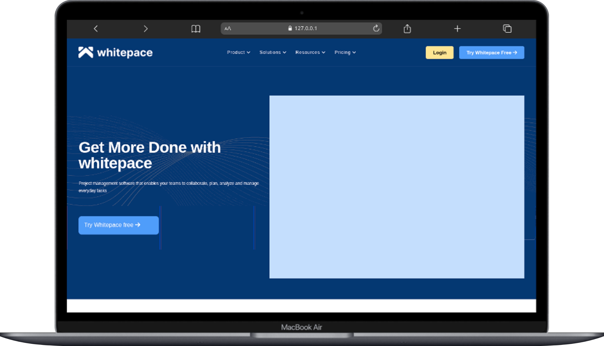

# 🌐 Whitepace — SaaS Landing Page

A pixel-perfect recreation of the Whitepace SaaS landing page, built from scratch using only HTML5 and CSS.
The project replicates a professional Figma design with full responsiveness across desktop, tablet, and mobile screens.

---

## 🎯 Project Goals

This project aims to:

- Practice semantic HTML5 and CSS without any frameworks
- Replicate a professional Figma design with precision
- Work with Flexbox and CSS Grid for complex layouts
- Build a fully responsive multi-section landing page
- Develop attention to detail in spacing, typography, and color

---

## The page includes

Hero section, Project Management, Customise, Pricing plans, Work, CTA , Data section, Sponsors, App section, Testimonials cards, Call-to-action section and  Footer.

---

## 🛠 Tech Stack

### Languages

- HTML5
- CSS3

### CSS Techniques Used

- CSS Grid
- Flexbox
- Media querie
- CSS custom properties
- Background images

### External Resources

- Font Awesome 6 (icons via CDN)

### Other Tools

- Git & GitHub
- Figma

---

## 🖥 Features

- Semantic HTML5 structure throughout
- Matching the Figma design
- Responsive navigation with hamburger menu toggle
- Hero section with background image overlay
- Two-column feature sections with alternating image/text layout
- Three pricing cards with
- Sponsor logos grid
- App section
- Testimonial cards
- Call-to-action section with platform icons (Apple, Windows, Android)
- Footer

---

## 🔗 Figma Design Reference

[Whitepace — SaaS Landing Page (Community)](https://www.figma.com/design/Ip0YLscX7e46Dxu1cVreDB/Whitepace---SaaS-Landing-Page-(Community)?node-id=9-100&p=f&t=ph5rB3i6qTqdcPAu-0)

---

## 📐 Responsive Breakpoints

| Breakpoint | Target |
| ≤ 1440px | Large desktops |
| ≤ 1152px | Medium desktops |
| ≤ 920px | Tablets |
| ≤ 568px | Mobile |
| ≤ 340px | Small mobile |

---

## 📷 Page Preview


### Desktop View



### Mobile View


---

## 📂 Project Structure

figma_design/
├── assets/
│   ├── images/
│   │   ├── Apple.png
│   │   ├── app.png
│   │   ├── Apps.png
│   │   ├── backelement.png
│   │   ├── BACKGROUND2.png
│   │   ├── BACKGROUND.svg
│   │   ├── client.png
│   │   ├── data.png
│   │   ├── Google.png
│   │   ├── logo.png
│   │   ├── Microsoft.png
│   │   ├── onde.svg
│   │   ├── Slack.png
│   │   ├── under.svg
│   │   └── Work_Together_Image.png
│   └── styles/
│       ├── responsive.css
│       └── style.css
└── index.html

---

## 🚀 Getting Started

Clone the repository:

```bash
git clone https://github.com/your-username/whitepace-landing.git
cd whitepace-landing
```

Open the project in your browser:

```bash
# Simply open index.html in any browser
open index.html
```

No build tools, no dependencies — just open and go.

---

## 🧠 Challenges Faced

- Replicating the exact grid and spacing from Figma without any framework
- Managing background images across sections at different screen sizes
- Building a clean responsive layout with CSS Grid and Flexbox working together
- Hiding and showing elements at the right breakpoints (nav menu, pricing cards, blue testimonial card)
- Aligning the footer's multi-column layout correctly on all screen sizes

---

## 📚 What I Learned

- How to translate a Figma design into clean HTML and CSS
- Advanced use of CSS Grid for multi-column layouts
- Managing background images responsively using `background-size` and `background-position`
- Structuring media queries from desktop down to small mobile
- Keeping CSS organized across multiple files (`style.css` + `responsive.css`)

---

## 🚀 Future Improvements

- Add JavaScript for the mobile hamburger menu
- Animate sections on scroll using Intersection Observer
- Add an active state for nav links

---

## 👨🏽‍💻 Author

Kembou Keumoe Ivan Michael
Junior Fullstack Developer
📩 Email: <kman39457@email.com>

🌍 Based in Cameroon | Open to remote opportunities
